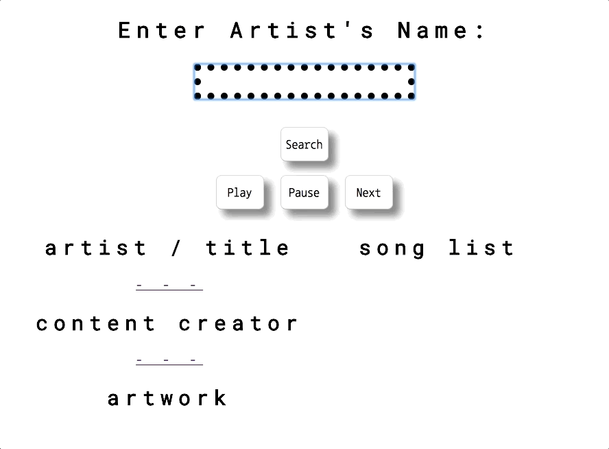

# SoundCloud API Music Player
### Description: A music player utilizing the Soundcloud API. Search the API. Display tracks. Play, pause and next options.

* README

### Note: In order to use this Soundcloud Player you need your own API Key.

This music player allows you to search Soundcloud by typing a word in an input field. It will return the tracks and convert them to a JSON object, and allow the user to play, pause and switch tracks.

It also includes the album artwork, and links to the content provider and track page.
